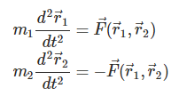

# Ukesoppgaver uke 42

### Dobbelplanetsystem
Til nå har du lært å simulere ett legeme som er påvirket av en eller flere krefter F(r ,v ,t). Det neste steget er å lære seg å simulere to legemer som påvirker hverandre med krefter, altså løse de følgende koblede ligningene:



Vi bryr oss foreløpig kun om konservative krefter så jeg har ikke tatt med hastigheten i kraften, men det er rett frem å generalisere.

For å løse to slike ligninger samtidig må du finne den momentane akselerasjonen til vært legeme og så oppdatere hastighet og posisjon med enten Euler eller Euler-Cromers metode.

Din oppgave er å simulere bevegelsen til dvergplaneten Pluto og månen dens Charon. Du kan få bruk for følgende verdier:

```
m_pluto = 1.309e22 # kilograms
m_charon = 1.62e21 # kilograms
mean_distance = 19599 # kilometers
```